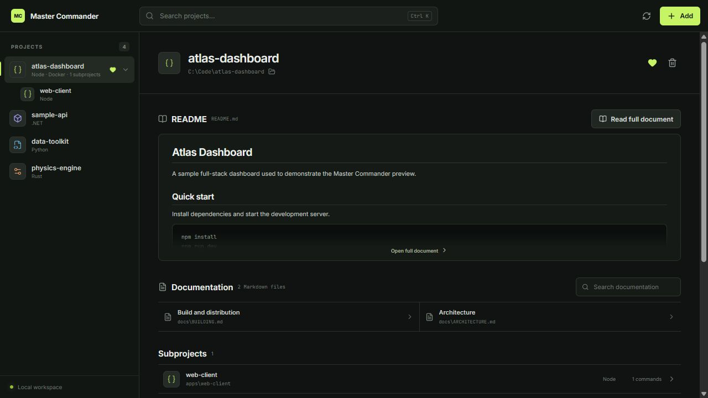

# Master Commander

**One desktop command center for all your local development projects.**

[](LICENSE)
[](#installation)
[](#installation)
[](https://www.electronjs.org/)

Master Commander is a standalone Windows and Linux application that discovers local software projects, understands the commands they expose, and lets you run everything from one focused workspace.

Add a project folder or a directory containing many projects. Master Commander detects the relevant toolchain, lists the available commands, renders the project's Markdown documentation, and gives every command an integrated console plus the option to run in a full system terminal.

> Master Commander works locally. It does not upload your projects, source code, commands, or documentation.



## Why Master Commander?

Development folders tend to accumulate projects with different runtimes, package managers, scripts, and startup instructions. Remembering whether a project needs `npm run dev`, `dotnet run`, `cargo test`, `uv run`, or a particular Docker Compose command quickly becomes friction.

Master Commander turns that folder into an operational workspace:

- keep all local projects in one place;
- discover commands from the files already present in each repository;
- preserve project/subproject relationships in monorepos;
- run commands without opening a new terminal for every repository;
- keep custom commands alongside automatically detected ones;
- read `README.md` and project documentation without leaving the application.

## Features

### Project discovery

- Add an individual project or a folder containing multiple projects.
- Only direct children of a workspace folder become top-level projects.
- Nested applications and packages are shown as children of their parent project.
- Generated folders, dependencies, caches, and build output are ignored.
- Unity projects are detected without turning `Library`, `Packages`, `Assets`, or cached modules into separate projects.

### Supported ecosystems

| Ecosystem | Detection | Commands |
| --- | --- | --- |
| Node.js | `package.json` | Every declared npm script; npm, pnpm, and Yarn install commands |
| .NET | `.sln`, `.csproj` | Restore, build, test, run |
| Rust | `Cargo.toml` | Check, build, run, test |
| Python | `pyproject.toml`, `requirements.txt` | Install, run, pytest; automatic uv and Poetry support |
| Go | `go.mod` | Run, build, test |
| Docker Compose | `compose.yml`, `docker-compose.yml` | Up, detached up, down, status |
| Unity | `Assets` and `ProjectSettings` | Project recognition and clean workspace grouping |
| Any folder | Always available | Persistent custom commands |

### Command execution

- Integrated console with live stdout/stderr.
- Standard input support for simple interactive commands.
- Stop running processes and their child processes.
- Open any command in a real external terminal for TUI applications, debuggers, prompts, and fully interactive processes.
- Copy commands without running them.

### Built-in documentation reader

- Preview the main `README.md` directly on the project page.
- Open and render the complete document with tables, lists, code blocks, and links.
- Index and search Markdown documentation contained in the project.
- Keep documentation assigned to the correct parent or nested project.
- Load full documents only when opened, keeping large workspaces responsive.

## Installation

### Windows

Prebuilt Windows packages can be produced in two formats:

- **Installer:** `Master Commander Setup <version>.exe`
- **Portable:** `Master Commander <version>.exe`

To build them locally:

```powershell
git clone https://github.com/ildevblu/master-commander.git
cd master-commander
npm install
npm run dist:win
```

The installer and portable executable are written to `release/`.

### Linux

Build an AppImage and Debian package on a Linux machine:

```bash
git clone https://github.com/ildevblu/master-commander.git
cd master-commander
npm install
npm run dist:linux
```

The generated `.AppImage` and `.deb` files are written to `release/`.

> Build Windows packages on Windows and Linux packages on Linux. Electron Builder can compile the application cross-platform, but the final native packaging tools are platform-specific.

## Run from source

Requirements:

- Node.js 22 or newer;
- npm 10 or newer;
- the runtimes required by the projects you want to execute.

```bash
git clone https://github.com/ildevblu/master-commander.git
cd master-commander
npm install
npm run dev
```

Useful commands:

```bash
npm run typecheck  # TypeScript validation
npm run build      # Production application build
npm run dist:win   # Windows installer and portable executable
npm run dist:linux # Linux AppImage and Debian package
```

## How project scanning works

When you select a workspace directory, Master Commander treats its direct child folders as top-level projects. It then scans inside each project for recognized manifests and assigns any nested applications to that parent.

The scanner skips common dependency and generated directories such as `node_modules`, `.git`, `dist`, `build`, `target`, `bin`, `obj`, virtual environments, caches, and Unity-generated folders. Markdown documentation is indexed separately up to a bounded depth and excludes the same generated content.

Workspace configuration, favorites, exclusions, and custom commands are stored in Electron's local application-data directory. Removing a project from Master Commander never deletes its files.

## Current status

Master Commander is an early open-source release. The core project discovery, command execution, hierarchy, persistence, and Markdown documentation flows are implemented and usable. Feedback, bug reports, additional ecosystem detectors, packaging improvements, and translations are welcome.

The application interface is available in English by default; broader localization is planned.

## Contributing

Issues and pull requests are welcome. Please keep changes focused, preserve the local-only security model, and validate both the TypeScript build and the affected runtime flow before submitting.

## License

Master Commander is released under the [Apache License 2.0](LICENSE). It is permissive and allows commercial use, modification, and redistribution. Distributions and derivative works must preserve the license and the attribution contained in [NOTICE](NOTICE), including the name and URL of the original Master Commander project.
